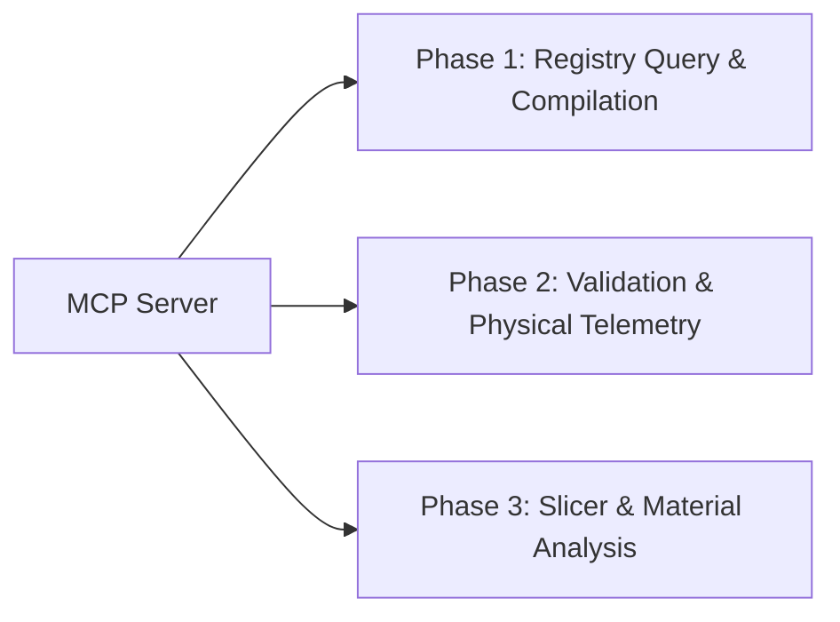

# Model Context Protocol (MCP) CAD Specification

This document details the design of a custom Model Context Protocol (MCP) server for Project B3. It bridges the gap between local AI models and low-level geometric engines, exposing complex CAD tasks as native, high-level tools.

---

## 1. Why MCP for CAD?
A Model Context Protocol (MCP) server runs as a lightweight local JSON-RPC process that communicates with coding agents. 

Instead of forcing a local LLM to execute shell commands, parse unstructured stdout, or write mathematical code to construct complex features, the LLM simply calls structured tools:

```text
Local LLM ──[JSON-RPC Tool Call]──> B3 MCP Server ──[SQLModel / build123d]──> Physical Assembly
```

This significantly reduces context window bloat, eliminates python formatting syntax errors, and isolates spatial calculation logic.

---

## 2. Core CAD Tools to Expose

To optimize local agent workflows, we propose implementing the following high-level tools first:

### `get_project_metadata`
* **Purpose**: Fetches the core parameters, description, and assembly structure of the active project.
* **Input Schema**:
  ```json
  {
    "project_id": "string"
  }
  ```
* **Returns**: JSON description of the project, including dimensions and registered module subdirectories.

### `get_mating_interface`
* **Purpose**: Retrieves target constraints, tolerances, install vectors, and clearance budgets for a mechanical interface.
* **Input Schema**:
  ```json
  {
    "project_id": "string",
    "interface_name": "string"
  }
  ```
* **Returns**: Tolerances, install vector (e.g., `[0, 0, 1]`), capture axes, and safety metrics.

### `check_component_interference`
* **Purpose**: Runs geometric collision/overlapping checks between two component models and returns volume.
* **Input Schema**:
  ```json
  {
    "component_id_a": "string",
    "component_id_b": "string"
  }
  ```
* **Returns**: `{"overlap_volume_mm3": float, "is_safe": boolean}`.

### `build_and_export_component`
* **Purpose**: Compiles a single part from python source code and updates its physical dimensions in the registry.
* **Input Schema**:
  ```json
  {
    "component_id": "string",
    "export_format": "string" // default "step"
  }
  ```
* **Returns**: Bounding box size, volume, path to generated file, and build validation logs.

---

## 3. Future Architectural Roadmap

As our registry capabilities mature, we can expand the MCP server's toolset to cover advanced optimization:



### Phase 2 Extension: Physical Telemetry
Expose physical-verification tools:
* `log_printed_weight(component_id, material, mass_g)`: Updates physical metadata.
* `get_mass_distribution()`: Aggregates weights across registered components and returns the estimated physical center of mass (CoM) compared to the theoretical CAD CoM.

### Phase 3 Extension: Print Optimization
Expose slicer-profile feedback tools:
* `get_print_recommendation(component_id)`: Analyzes bounding box heights and thin-wall geometry, recommending specific print speeds, cooling schedules, or orientation settings to prevent layer delamination.
