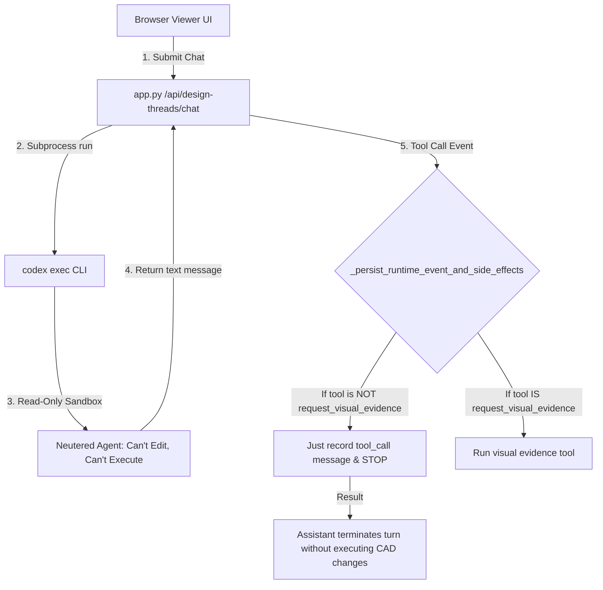

# Flow CAD Architectural Review & Suggestions

This document provides a comprehensive review of the current performance and agent orchestration architectures in Flow CAD. It analyzes the bottlenecks that led to the "dumb router" behavior during the Codex integration and provides a concrete path forward to establish a functional, fast, and unified MCP + LLM tool execution model.

---

## 1. Executive Summary & Verdict

### The Verdict: Solid CAD Foundations, Broken Agent-Orchestration Layer

*   **The Geometry Foundation is OK**: The STEP-first geometry authority, the isolated transaction store ([DraftGeometryStore](file:///home/gnulnx/flow-cad/src/flow_cad/draft_geometry.py#L181)), and the focused validation framework ([FocusedValidatorRunner](file:///home/gnulnx/flow-cad/src/flow_cad/validation/runner.py)) are clean, performant, and structurally sound. They isolate CAD operations from production code and keep design feedback fast (under 2 seconds for geometry operations).
*   **The Agent Integration is Broken**: The interface between the LLM and these CAD tools is non-functional. Spawning an external agent CLI (`codex exec`) in a read-only sandbox, combined with the lack of a tool execution loop in the viewer backend, has crippled the system. Instead of acting as an active design assistant that executes actions, gets results, and iterates, the LLM is forced to act as a "dumb router"—simply suggesting actions in text form for the user to execute manually.

---

## 2. Deep Dive: Why the Assistant Became a "Dumb Router"

The failure of the current assistant implementation is caused by two compounding architectural bottlenecks:



### Bottleneck A: The Sandboxed Subprocess Catch-22
To delegate chat execution to Codex without requiring Flow CAD to manage credentials, the system uses [CodexExecAgentRuntimeClient](file:///home/gnulnx/flow-cad/src/flow_cad/viewer/agent_runtime.py#L415) to shell out to `codex exec` via a subprocess.
1.  **Read-Only Filesystem**: To prevent the subprocess from making unsafe modifications, it is run with `--sandbox read-only`.
2.  **Explicit Prohibition**: The prompt explicitly instructs Codex: *"Do not mutate CAD source... Do not call generic shell or filesystem mutation tools... Propose Flow CAD draft operations only."*
3.  **The Result**: The agent is locked in a box. It cannot write code, cannot compile STEP/STL files, cannot run validators, and cannot query the CAD kernel directly. It is reduced to generating conversational suggestions.

### Bottleneck B: The Missing Tool Execution Loop
In [app.py](file:///home/gnulnx/flow-cad/src/flow_cad/viewer/app.py), the backend advertises a list of "CAD-safe tools" ([_cad_safe_tools](file:///home/gnulnx/flow-cad/src/flow_cad/viewer/app.py#L65)), such as `create_draft_transaction` and `apply_draft_operations`.
However, when the LLM client emits a `tool_call` event:
*   The event is passed to [_persist_runtime_event_and_side_effects](file:///home/gnulnx/flow-cad/src/flow_cad/viewer/app.py#L721).
*   **The backend does not execute the tool.** If the tool is anything other than `request_visual_evidence`, the backend simply records the `tool_call` as a text event in the design thread and **stops**.
*   Because the tool is not executed, no `tool_result` is returned, and the LLM is never prompted to continue its turn. The interaction halts immediately.

---

## 3. Core Foundation Assessment

### What is Solid (Keep & Build Upon)
*   **STEP-First Authority**: The pipeline prioritizing STEP geometry over STL meshes ([GEOMETRY_FOUNDATION.md](file:///home/gnulnx/flow-cad/docs/GEOMETRY_FOUNDATION.md)) keeps topology exact and prevents the LLM from attempting fuzzy mesh edits.
*   **Durable Transactions ([DraftGeometryStore](file:///home/gnulnx/flow-cad/src/flow_cad/draft_geometry.py#L701))**: The transaction store isolates modifications inside `.flow/draft-transactions/` without corrupting production code. This is perfect for rapid previewing.
*   **Focused Validators**: Running targeted checks in seconds instead of compiling the entire assembly is the correct path for interactive speeds.
*   **MCP Server Design ([mcp/server.py](file:///home/gnulnx/flow-cad/src/flow_cad/mcp/server.py))**: The MCP server maps tools directly to Python service APIs. It is clean and behaves correctly when invoked by external agents (e.g., Claude Desktop).

### What is Fragile/Broken (Refactor or Remove)
*   **Subprocess LLM Client (`codex exec`)**: Using a CLI command as a streaming LLM wrapper is slow, fragile, and limits token streaming and multi-turn loops.
*   **Divergent Tool Sets**: We have one set of tool definitions for the MCP server (`draft_transaction_create_box`, `validator_run`) and a different set for the viewer backend (`create_draft_transaction`, `apply_draft_operations`). This duplication leads to drift and bugs.
*   **Lack of a ReAct Loop**: The chat endpoints in [app.py](file:///home/gnulnx/flow-cad/src/flow_cad/viewer/app.py#L1237) treat assistant turns as single-turn text completions, rather than executing a loop to resolve tool calls.

---

## 4. The Path Forward: A Unified MCP + LLM Architecture

To make the assistant functional, we must unify tool execution so that both the **external MCP server** and the **internal browser chat** call the exact same tool execution logic.

```
                  +-----------------------------------------+
                  |           Browser Viewer UI             |
                  +-----------------------------------------+
                                    |
                                    | (SSE / HTTP Chat)
                                    v
                  +-----------------------------------------+
                  |          Viewer Backend (app.py)        |
                  +-----------------------------------------+
                                    |
                                    v (Direct API calls: OpenAI/Gemini/Llama)
                  +-----------------------------------------+
                  |         ReAct Tool Execution Loop       |
                  |  - Sends prompt                         |
                  |  - Receives Tool Call                   | <----+
                  |  - Invokes Local Tool Registry           |      |
                  |  - Feeds Tool Result back to LLM        | -----+
                  +-----------------------------------------+
                                    |
                                    +-----------------------+
                                    |                       |
                                    v                       v
                  +-------------------------------------------------+
                  |              Shared Service Layer               |
                  |  - DraftGeometryStore (Box, Hole, Slot, etc.)   |
                  |  - FocusedValidatorRunner                       |
                  |  - DesignThreadService                          |
                  +-------------------------------------------------+
                                    ^                       ^
                                    |                       |
                  +-----------------------------------------+
                  |             Flow CAD MCP Server         |
                  +-----------------------------------------+
                                    ^
                                    | (MCP Protocol)
                  +-----------------------------------------+
                  |       External Agent (e.g. Claude)      |
                  +-----------------------------------------+
```

### Step 1: Establish a Shared Tool Registry
Create a unified tool registry in `src/flow_cad/tools/registry.py`. Every tool should be declared once:
1.  **Schema**: Name, description, and JSON schema parameters.
2.  **Handler**: A Python function that maps the tool arguments directly to `DraftGeometryStore` or validation/thread services.

```python
# Conceptual Unified Tool Structure
@tool_registry.register(
    name="draft_transaction_add_hole",
    description="Add a through-hole inside a draft transaction."
)
def handle_add_hole(project_root: str, transaction_token: str, face: str, x: float, y: float, diameter: float) -> dict[str, Any]:
    store = get_draft_store(project_root)
    return store.transaction_add_hole(transaction_token, face=face, x=x, y=y, diameter=diameter)
```

Both [mcp/server.py](file:///home/gnulnx/flow-cad/src/flow_cad/mcp/server.py) and [app.py](file:///home/gnulnx/flow-cad/src/flow_cad/viewer/app.py) should load their tool declarations and handlers from this registry.

### Step 2: Implement a ReAct Loop in the Viewer Backend
When the browser viewer initiates a chat turn, the backend must run a standard ReAct execution loop:

```python
# Conceptual ReAct execution loop in app.py
def run_agent_loop(thread_id, messages, context_packet, model_profile):
    tools = tool_registry.get_schemas()
    iteration = 0
    max_iterations = 5

    while iteration < max_iterations:
        # 1. Get completion from the LLM client
        chunk_iter = agent_runtime.stream_chat(thread_id, messages, context_packet, tools, model_profile)
        
        tool_calls = []
        for event in chunk_iter:
            if event["type"] == "assistant_delta":
                yield event  # Stream text deltas back to the frontend immediately
            elif event["type"] == "tool_call":
                tool_calls.append(event)
        
        if not tool_calls:
            break  # The model finished generating text without calling tools

        for tool_call in tool_calls:
            # 2. Execute the tool locally using the Shared Tool Registry
            result = tool_registry.execute(
                name=tool_call["tool"], 
                args=tool_call["arguments"], 
                context=context_packet
            )
            
            # 3. Persist the tool call and result in the thread
            persist_tool_events(thread_id, tool_call, result)
            
            # 4. Append events to messages so the model sees them in the next turn
            messages.append({"role": "assistant", "tool_calls": [tool_call]})
            messages.append({"role": "tool", "name": tool_call["tool"], "content": json.dumps(result)})
            
        iteration += 1
```

### Step 3: Replace CLI Subprocesses with Direct API Clients
Abandon the `codex exec` subprocess bridge. It introduces unnecessary OS latency and sandboxing limitations.
*   Use the resolved config profiles from [config.py](file:///home/gnulnx/flow-cad/src/flow_cad/config.py) to initiate direct API calls (via standard HTTP requests) to Gemini, OpenAI, or local runtimes like LM Studio and LlamaStudio.
*   If token authentication for Codex is needed, obtain the token once and supply it as an environment variable or config parameter. Avoid calling the `codex` binary as a wrapper.
*   Since the LLM is restricted to calling tools from the **Shared Tool Registry** (which only performs safe operations inside `.flow/`), the backend no longer needs to run in a read-only sandboxed subprocess. Safety is enforced by the boundaries of the tools, not by disabling the filesystem.

---

## 5. Concrete Action Plan & Milestones

### Milestone 1: Tool Registry & Unified Schema
*   Define `src/flow_cad/tools/registry.py`.
*   Migrate all geometry, validator, and evidence tools into this registry.
*   Refactor [mcp/server.py](file:///home/gnulnx/flow-cad/src/flow_cad/mcp/server.py) to import and register tools from this registry.
*   **Verification**: Run the MCP server tests to ensure all tools behave identically.

### Milestone 2: Backend ReAct Loop Implementation
*   Implement `run_agent_loop` in [app.py](file:///home/gnulnx/flow-cad/src/flow_cad/viewer/app.py).
*   Ensure tool calls and tool results are recorded in the [DesignThreadService](file:///home/gnulnx/flow-cad/src/flow_cad/viewer/threads.py#L583) messages log so that the conversation history stays complete.
*   **Verification**: Test with `FakeAgentRuntimeClient` to verify the loop can process a tool call and yield text deltas and tool results in order.

### Milestone 3: Direct API Runtimes
*   Implement direct Gemini and OpenAI adapters in [agent_runtime.py](file:///home/gnulnx/flow-cad/src/flow_cad/viewer/agent_runtime.py) using standard streaming HTTP requests.
*   Remove the `CodexExecAgentRuntimeClient` once direct clients are verified.
*   **Verification**: Verify streaming responses and multi-turn tool execution using local mock endpoints.

### Milestone 4: Frontend State Synced Previews
*   Update the React frontend ([App.tsx](file:///home/gnulnx/flow-cad/viewer/stl-viewer/src/App.tsx)) to listen for incoming `tool_result` events.
*   If a tool result indicates a new preview model token was generated, update the 3D viewport immediately to show the drafted changes without requiring the user to manually hit reload.
