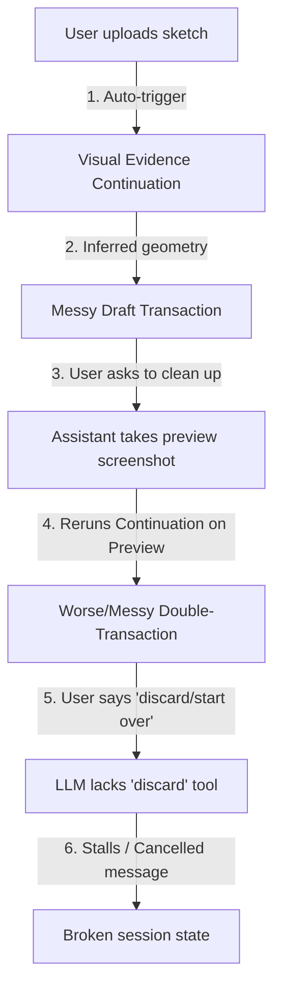

# Gemini Drafting Proposal: Concept & Transaction Lifecycle Alignment

This proposal outlines the architectural changes required to resolve the drafting loop stalls and feedback failures observed in the Flow CAD workbench. 

---

## 1. Problem Statement & Root Cause Analysis

During a design session (e.g., in `Session mq9fgs3d`), the browser assistant stalls or gets trapped in a cycle where it claims *"the draft tool call was cancelled"* and fails to clean up or modify the model. 

This behavior is caused by three compounding issues:

### A. The Screenshot Feedback Loop
When a user uploads a sketch, the backend's `flow_cad_visual_evidence_continuation` pipeline triggers automatically, interpreting the image and creating a draft transaction with inferred footprint and holes.
However, when the user asks to *"clean up"* or *"make it symmetrical,"* the assistant requests a screenshot of the 3D viewer. Because the backend does not distinguish between a user's original sketch upload and a system-generated screenshot of the active 3D draft preview, it runs the sketch-recipe continuation pipeline again on the screenshot of the preview. This overrides or compounds the geometry with a second, messier transaction.

### B. Missing Transaction Control Tools
The assistant chat endpoint (`_cad_safe_tools`) advertises only a subset of tools to the LLM. While the registry defines `draft_transaction_discard` and `draft_transaction_accept`, these tools are **not** exposed to the LLM. 
When the user says *"discard this"* or *"OK let's do that"* (to start a new transaction), the LLM wants to discard the old transaction, but has no tool to do so. It is forced to yield a conversational fallback stating the call was cancelled, leaving the workspace in a broken state.

### C. Conceptual vs. Parametric Mismatch
The assistant currently treats the rough sketch outline as an absolute CAD boundary ("geometric truth"). There is no intermediate step where the assistant summarizes the layout parameters (e.g., *"I see a plate of roughly 100x65mm with 12 holes. Shall I draft it with symmetric grid spacing?"*) for the user's approval before generating the actual transaction.

---

## 2. Proposed Changes

We propose a four-part remediation plan to make drafting fast, conceptual, and reliable.

### Part 1: Expose Lifecycle Tools in the Chat Toolset
Expose transaction control tools to the design-threads assistant client so that the LLM can discard or accept active drafts programmatically when requested.

- Add the following tools to the `cad_safe_names` list in [_cad_safe_tools](file:///home/gnulnx/flow-cad/src/flow_cad/viewer/app.py#L82):
  - `draft_transaction_accept` (maps to `draft_transaction_accept_tool`)
  - `draft_transaction_discard` (maps to `draft_transaction_discard_tool`)

### Part 2: Prevent Rerunning Sketch Interpretation on Preview Renderings
Introduce guards to ensure that screenshots captured of the active draft preview are used only as visual feedback for the LLM, and **never** fed back into the automatic `visual_evidence_continuation` sketch parser.

- Modify the visual-evidence event hook to check the source or metadata of the request.
- If the visual evidence request was triggered for an active draft preview (e.g., `purpose="preview"` or containing `draft_transaction_token`), skip the automatic geometry generator and simply return the image URL to the design thread as context.

### Part 3: Implement a Conceptual "Layout Handshake"
Break the pipeline into two steps:
1. **Concept Summary**: When a sketch is uploaded, the LLM provides a high-level text summary of the inferred intent (e.g., *"I detected an approximate 100x65mm bracket with 4 mounting holes. Should we generate a symmetrical layout using M4 counterbores?"*).
2. **Draft Execution**: The LLM awaits the user's confirmation (*"Yes, do that"*) before invoking `create_draft_transaction` and applying the operations.

### Part 4: Add Semantic Operations for Symmetrical Cleanup
Add high-level helper operations to [ToolRegistry](file:///home/gnulnx/flow-cad/src/flow_cad/tools/registry.py#L83) to allow the LLM to apply symmetry constraints without manually re-calculating coordinates:
- `draft_transaction_make_symmetrical`: Aligns all holes/slots to a symmetrical centerline or grid based on bounding box dimensions.

---

## 3. Verification Plan

1. **Unit Tests**:
   - Verify that `draft_transaction_accept` and `draft_transaction_discard` are present in the list of schemas returned to the chat assistant.
   - Mock a visual-evidence continuation event with a draft preview purpose and verify it does not trigger the recipe parser.

2. **Integration Verification**:
   - Start the viewer workbench in `flow_test`.
   - Upload a sketch, verify the concept layout is proposed, confirm the draft creation, verify cleanup using *"make it symmetrical"*, and successfully execute a discard/restart turn.
