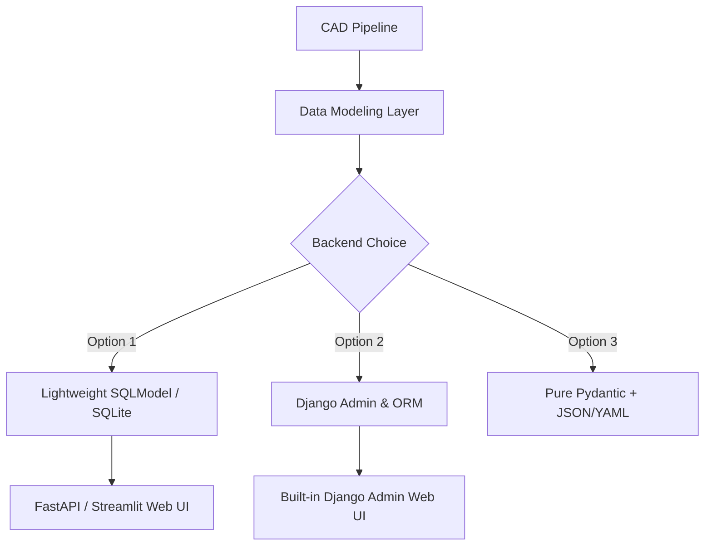

# Brainstorming: Phase 2 - Registry-Driven Workflow (B3 Project)

This document explores architectural designs for transition from file-manifest-driven CAD to a robust, scalable, registry-driven CAD workflow. It aims to support multi-robot variants, structural component registries, print specifications, and geometric verification.

---

## 1. Naming & Namespace Refactor: "Erb" to "B3"

"B3" is a clean, modern identifier. The transition away from the legacy "erb" prefix offers a perfect opportunity to establish a formal namespace convention.

### Proposed Hierarchical Directory & File Names
Instead of long, flat, single-level filenames like `erb_lower_chassis_left_side_plate.step`, we can use structured namespaces. 

#### Option A: Project-Root Hierarchical Structure (Recommended)
Organize exports logically with the project folder at the entry point of the directory structure:
```text
b3/
├── exports/
│   ├── step/
│   │   ├── lower_chassis/
│   │   │   ├── left_side_plate.step
│   │   │   ├── right_side_plate.step
│   │   │   ├── bottom_tray.step
│   │   │   └── axle_insert_tight.step
│   │   └── upper_module/
│   │       ├── center_adapter_deck.step
│   │       └── perception_pod.step
│   └── freecad/
│       └── b3_lower_chassis_assembly.FCStd
└── reports/
    └── stage1_lower_chassis_report.txt
```
* **Pros**: 
  - **Multi-Project Workspace**: Allows the repository to scale naturally to other robots (e.g. `b4`, `argo`) side-by-side without overlapping files.
  - **High Isolation**: All project-specific inputs, outputs, reports, and FreeCAD files live cleanly under the project's own subdirectory.
  - **Intuitive Navigation**: Translates seamlessly to object models and configurations.

#### Option B: Clean Separators (Dots or Underscores)
If a flat directory is required, use structured naming:
* **Dots**: `b3.lower_chassis.left_side_plate.step` (Matches object-oriented naming, but some slicers/CAD tools struggle with dot-heavy extensions).
* **Underscores**: `b3_lower_chassis_left_side_plate.step` (Extremely robust cross-platform compatibility).

---

## 2. Modeling the Registry (SQLite, Django, SQLModel)

A database allows us to store rich metadata about each part:
* **Core CAD Metadata**: Name, project, module, physical volume, surface area, and bounding box dimensions.
* **Manufacturing Spec**: Material (PLA, PETG, TPU), nozzle size, shell count, infill percentage, and estimated print duration.
* **Mating & Interfaces**: Relationships between parts, tolerances, clearances, screw sizes, and installation vectors.
* **Physical Weights**: Measured weight after printing vs. theoretical CAD-calculated mass.

### Architectural Options



### Option 1: SQLite + SQLModel (SQLAlchemy & Pydantic) (Highly Recommended)
SQLModel is a modern framework combining the power of **SQLAlchemy** (database operations) with **Pydantic** (data validation and serialization).
* **Why it fits**:
  - Very lightweight, no heavy server setup required.
  - Pydantic models map beautifully to CAD parameters and validation checks.
  - Can quickly spin up a local **FastAPI** or **Streamlit** dashboard for human/agent interaction (e.g., checking off printed parts, recording actual weights).
* **Database Schema Example (Pydantic / SQLModel)**:
  ```python
  from sqlmodel import SQLModel, Field, Relationship
  from typing import Optional, List

  class Project(SQLModel, table=True):
      id: str = Field(primary_key=True) # e.g. "b3"
      name: str
      description: Optional[str] = None

  class Component(SQLModel, table=True):
      id: str = Field(primary_key=True) # e.g. "b3.lower_chassis.left_side_plate"
      project_id: str = Field(foreign_key="project.id")
      module: str # e.g. "lower_chassis"
      name: str   # e.g. "left_side_plate"
      
      # CAD Geometry Cache
      theoretical_volume_mm3: float
      bbox_x: float
      bbox_y: float
      bbox_z: float
      
      # Print Specs
      material: str = "PLA" # TPU, PETG
      infill_pct: int = 40
      print_weight_g: Optional[float] = None # Measured physical weight
  ```

### Option 2: Django & SQLite (Robust & Built-in Admin)
Django is a full-featured web framework.
* **Why it fits**:
  - The **Django Admin Panel** is legendary. Without writing any UI code, you get a fully functional database editor to add components, modify parameters, and record physical print weights.
* **Why it might be overkill**:
  - Requires migrations, settings files, and extra overhead.
  - Harder to run as a pure lightweight CLI utility without invoking a Django environment.

### Option 3: Registry as Code (YAML / JSON Schema + Pydantic)
Keep data in version-controlled text files (e.g., `registry.yaml`), parsed dynamically.
* **Why it fits**:
  - 100% git-tracked, diffs are easy to read in PRs, zero database files to maintain.
* **Why it falls short**:
  - Harder to run relational queries or dynamically capture runtime telemetry from print scales.

---

## 3. Workflow Integration

With a registry in place, the `flow` tool expands dynamically:

```bash
# Initialize a new robot project
flow project init b3 --desc "Two-wheel self-balancing waiter robot"

# List register-defined components, status, and print statistics
flow registry list --project b3

# Record the actual physical weight of a printed part to compute center of mass
flow registry record-weight b3.lower_chassis.left_side_plate 142.5 --material "PETG"

# Sync registry specs back to generate the Bambu Studio print manifest automatically
flow manifest generate
```

---

## 4. Next Steps & Discussion
1. **Namespace**: Do we want a hierarchical folder structure (`exports/step/b3/lower_chassis/...`) or flat files with clean names?
2. **Registry Storage**: Do you prefer the lightweight SQLite + SQLModel approach (which allows a very fast FastAPI visual dashboard), or the instant Django Admin?
3. **Data Scope**: What metadata beyond dimensions, print material, and actual weight is most critical to track first?
